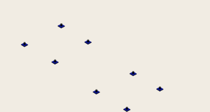
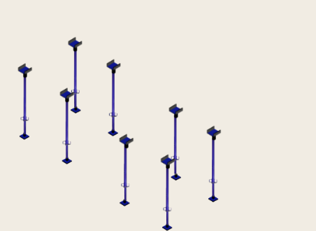
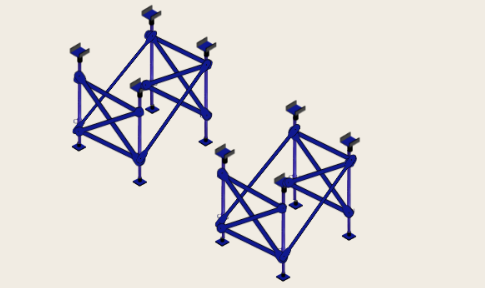
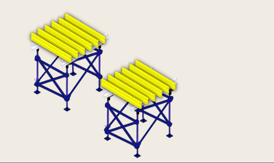
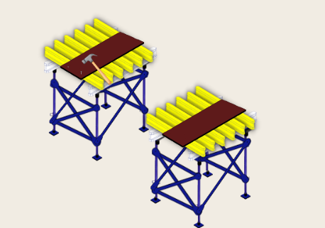
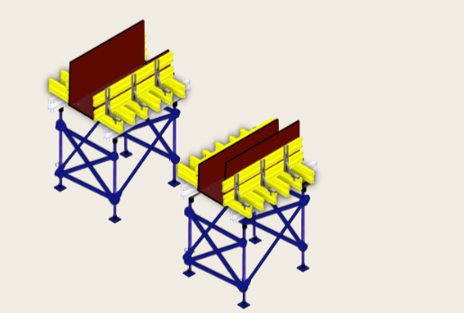
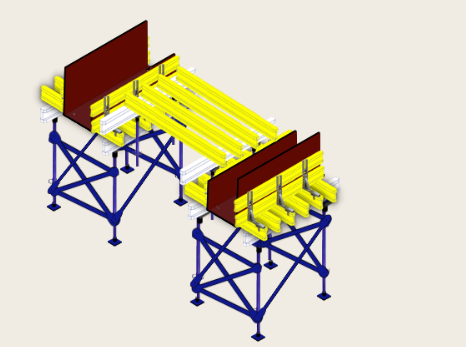
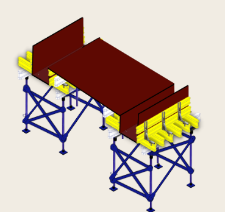

### Procedure

#### 1. Accurately mark the locations where the base plate is to be placed at the site. 

   
  Fig.2 Base Plates

  
#### 2. Bring all the relevant materials and apparatus required to erect formwork. 

   
  Fig.3 CT props with U-Head

#### 3. For each beam, place 4 base plates. E.g., if two beams are cast, 8 base plates will be placed. 

  
#### 4. On the base plates, place CT props 

  
#### 5. Mount U-head on the top of the CT prop 

   
  Fig.4 HD Tower with bracings

  
#### 6. Attach horizontal and diagonal  bracings to the HD tower to provide lateral  support and stiffness to the structure 

   
  Fig.5 Aluminum and Timber beam attached

  
#### 7. Attach an aluminum beam to the basic frame on both HD towers. Aluminum beams are used as they are lightweight and, hence, easy to install. Place 2 aluminum beams in the direction of the concrete beam for each HD tower. 

  
#### 8. Place timber beams on top of the aluminum beams. The orientation of timber beams shall be perpendicular to that of aluminum beams. 

   
  Fig.6. Sheathing with nails to attach it to timber beam

  
#### 9. On top of the timber beams, place sheathing and use nails to secure the sheathing. 

   
  Fig.6. Sheathing and Timber Beam attached to BFS

  
#### 10. Attach beam forming support to the timber beams. BFS (beam forming support) helps support the beam being cast. 

  
#### 11. Attach timber beams to the BFS firmly in the direction of the beam to be cast. These timber beams will help resist horizontal loads on the sheathing during concreting and curing. 

   
  Fig.7 Timber Beam on top of Aluminum Beam with Short Prop as support

  
#### 12.  Attach short props for slab formwork 

  
#### 13.  To these short props, attach U-heads to make a place for the aluminum base plates to be placed 

  
#### 14.  On the tip of aluminum beams, place timber beams in a perpendicular direction. 

   
  Fig.8 Placement of Sheathing

  
#### 15. On the top of timber beams, place sheathing and sure it to timber beams using nails. 

