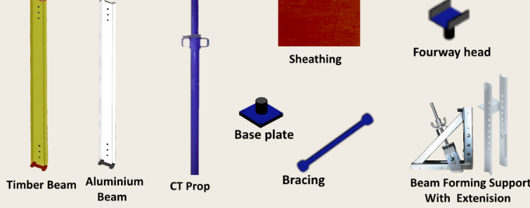

### Theory

 

#### APPARATUS: 
Timber beam, Plywood sheeting, AlumiNum Beam, Bracing, U- head, Beam Forming Panel, Beam Forming Support with Extension, Hammer and Nail

#### 1. THEORY: 
An effective formwork system must exhibit several critical characteristics to ensure structural integrity and economic efficiency. These include robust load-bearing capacity to accommodate both dead and live loads, superior shape retention, leak-proof seals at joints, minimal concrete damage upon removal, utilization of durable and reusable materials, lightweight for logistical efficiency, and resistance to warping and distortion under environmental conditions. The HD tower is a versatile shoring tower designed for supporting traditional formwork, primary and secondary beams, and plywood in cast-in-place concrete structures like slabs, beams, and work platforms. It boasts a high load capacity, modularity, and adequate provision for bracing, making it highly effective for high-level slab formwork or thick deck formwork in construction. Additionally, its lightweight components make the HD tower suitable for under-shoring concrete structures facing temporary overloads, as well as for underpinning, underscoring its adaptability and efficiency in a wide range of construction scenarios. 

 

#### APPARATUS REQUIRED 

   
  Fig.1 Apparatus required

-   <b>Base plate:</b> Base plates, essential for scaffolding stability, must be vertically adjustable and meet specific endurance and rigidity standards to support the scaffold's maximum load. These components are crucial in transferring the load from the scaffold to the ground. Complying with established standards, base plates feature an adjusting shaft to accommodate various heights, ensuring a reliable and safe structure for construction or maintenance work. 
-   <b>Sheathing:</b> Sheathing serves to protect structures from elements, provide a foundation for materials, and enhance structural integrity. It includes exterior wall sheathing for structural support and insulation, floor sheathing offering a work surface and load distribution, and roof sheathing for lateral support and weight distribution. Made from materials like wood, fiberboard, and cement, sheathing is crucial in construction, offering a protective layer for framing before final exterior finishes. Sheathing materials vary widely including wood, fiberboard, cement, gypsum, and glass mat. Each has unique properties, such as moisture resistance and strength, making them suitable for different applications in construction like exterior walls, floors, and roofs. 
-   <b>U-Head:</b> U heads, essential for shoring scaffolds in concrete construction, come in fixed and adjustable variants to support timber, steel, or aluminum beams. Fixed U heads connect through tubular or striped spigots and are categorized as two-way and four-way (fixed fork head). Adjustable versions, known as scaffold U jacks, feature a thread for height adjustment and are available in two-way and four-way fork head designs, facilitating versatility in construction scaffolding setups. 
-   <b>Beam forming supports:</b> The beam forming support is a device that significantly simplifies conventional beam formwork, enhancing construction efficiency. It comprises the main support, an adjustable extension, and a clamp to fit different beam widths. Compatible with timber beam or wood batten, it can be supported by floor props or scaffoldings, using various panel materials. 
-   <b>Timber beam:</b> Timber formwork offers several benefits in construction, including cost-effectiveness, ease of handling and installation, customizable shapes, moisture absorption to prevent concrete cracking, environmental friendliness due to its renewable nature, good insulation properties, and reusability. These advantages make it a sustainable and efficient choice for supporting concrete during curing. 
-   <b>Aluminium Beams:</b> The aluminum alloy formwork is cost-effective and labor-saving, featuring high turnover, easy installation, and minimal need for secondary batching. It offers strong reusability, potentially 150-300 times, significantly reducing per-use cost. Moreover, it enhances construction efficiency, with skilled workers installing 20-30 square meters daily, and diminishes plastering expenses due to its precision. 
-   <b>CT Props:</b> Props are essential in horizontal formwork systems, ensuring they're positioned at the desired height. As critical load-bearing components, props are key in transferring loads to the ground during concreting and supporting the structure until it's strong enough for use. These adjustable and telescopic props typically consist of two hollow cylinders - a body and a shaft, sometimes featuring a lock to prevent separation and an unloading mechanism for easier disassembly. 
-   <b>Bracings:</b> Bracing constitutes ancillary components of formwork systems, engineered to counteract lateral forces and ensure structural stability. Often termed as lateral bracing in recognition of their function, these elements are integral to maintaining both stability and safety. It is imperative that sufficient bracing be installed to withstand wind and other lateral pressures that may arise throughout the construction process. 

